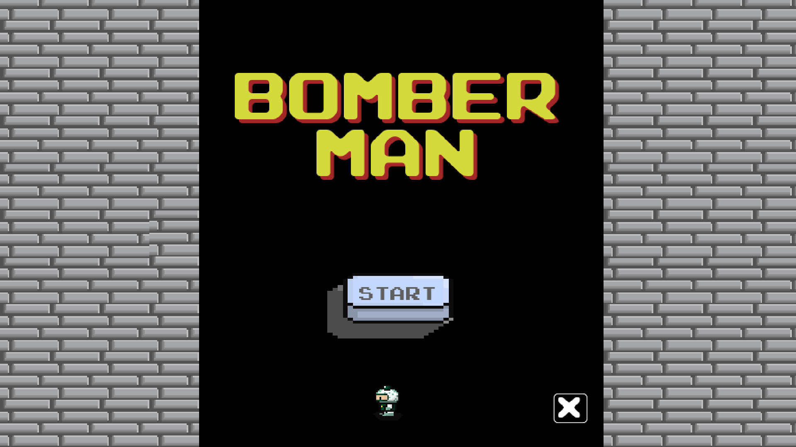
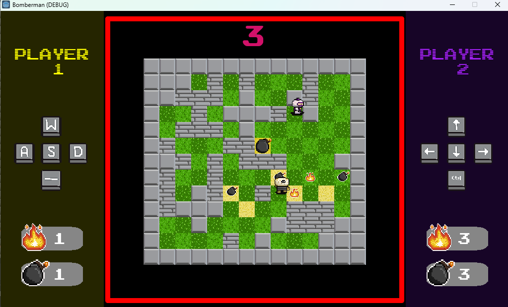

# Bomberman Game - Godot 3 with .NET

This Bomberman game is developed using the Godot game engine with .NET integration,
created by the Videogame Development Club of the UNT. Inspired by the classic arcade game,
it offers an exciting 2 local player experience where players gains powerups and strategically 
place bombs to defeat opponents and navigate through maze-like levels.

## Instructions to Open with Godot

1. Ensure you have Godot Engine 3 installed on your system. If not, download it [HERE](https://godotengine.org/download/3.x/windows/)
2. Clone or download this repository to your local machine.
3. Launch the Godot Engine and open the game project folder.
4. Select the project folder and click "Open" to load the Bomberman game project into Godot.
5. Once the project is loaded, you can explore the game's scripts, scenes and launch it from there.

## Screenshots

If you encounter any issues or have suggestions for improvement, don't hesitate to reach us or make pull requests. Enjoy playing Bomberman!
